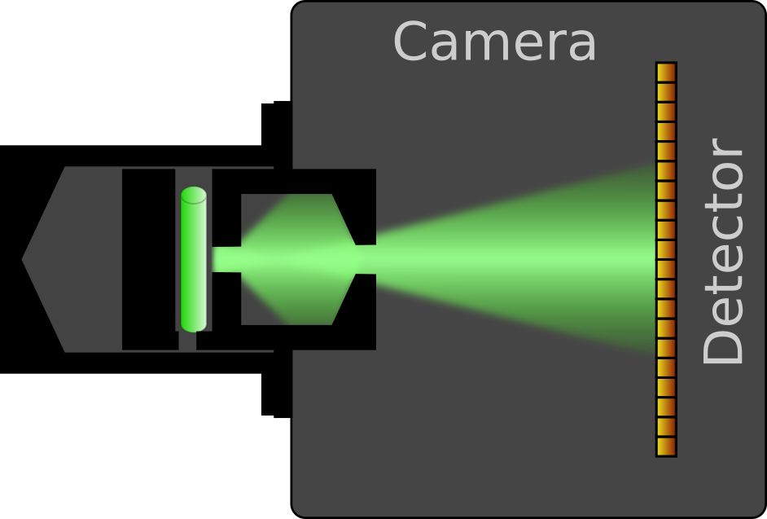
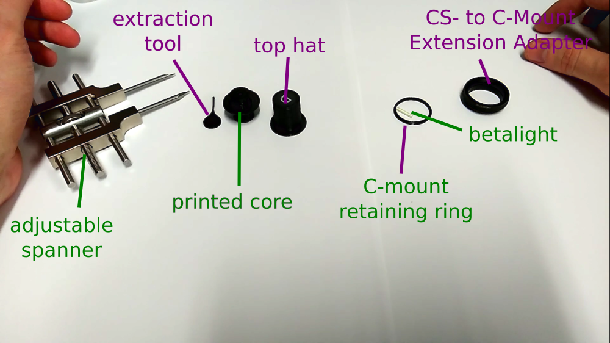
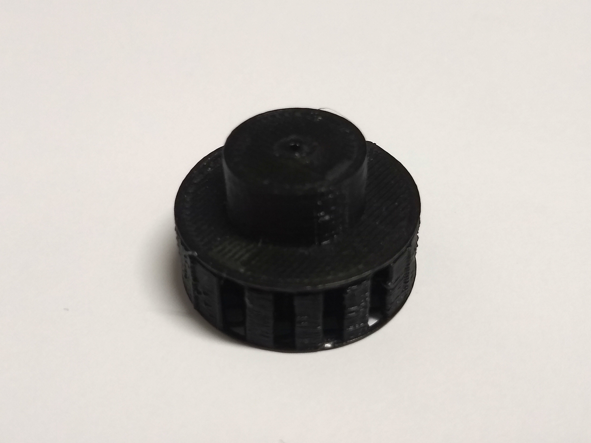
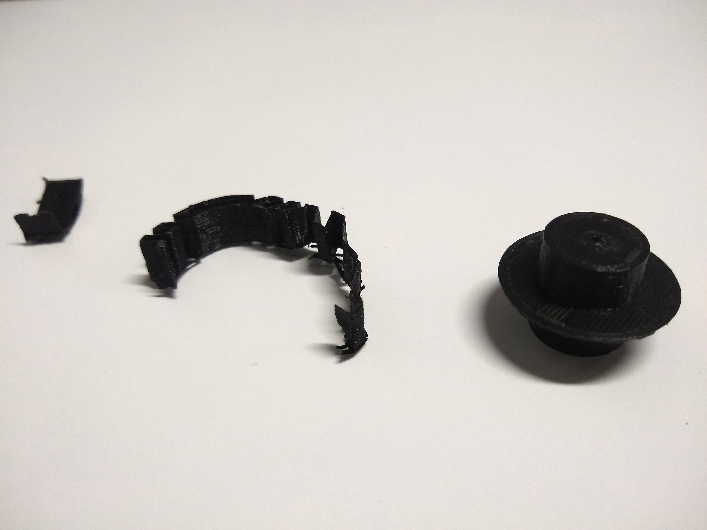
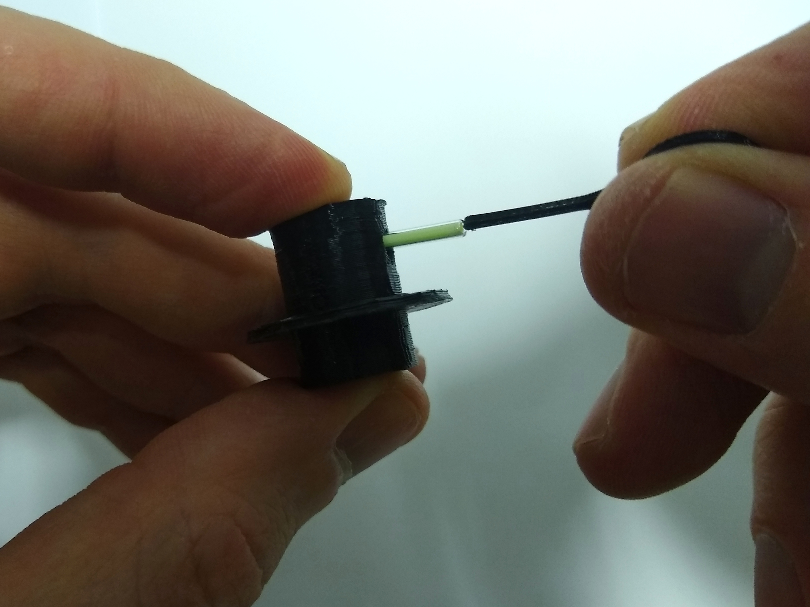
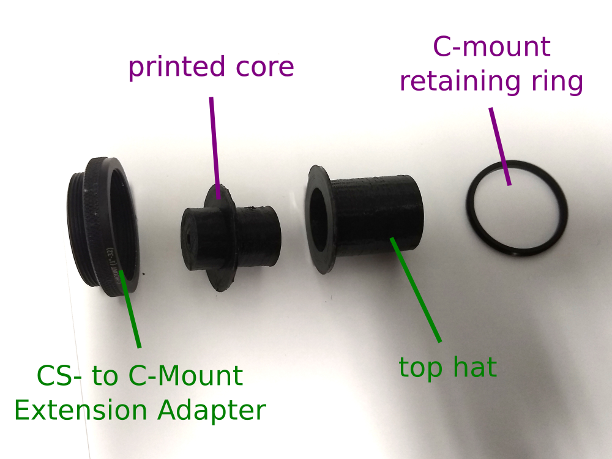
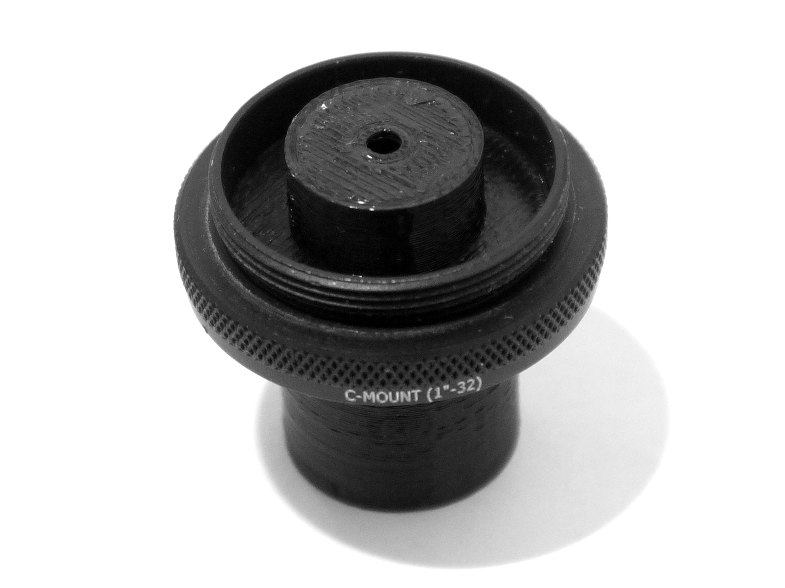
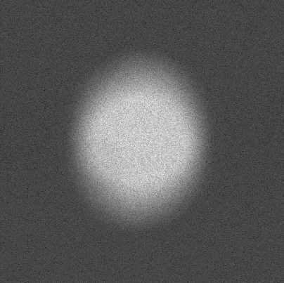

# GTLS-based calibration source for cameras

-- David McFadden

This page describes a mount for a Gaseous Tritium Light Source (GTLS or
"betalight"). The mount is designed to illuminate the image plane of a c-mount
camera and produce a spot size of approximately 4mm.

### Non-printed parts

| Number | Description                                                         | Possible supplier                                                                                                                                           | Approx. Price |
| ------ | ------------------------------------------------------------------- | ----------------------------------------------------------------------------------------------------------------------------------------------------------- | ------------- |
| 1      | Thorlabs C-mount retaining ring                                     | https://www.thorlabs.de/thorproduct.cfm?partnumber=CMRR                                                                                                     | 11.52 EUR     |
| 1      | Thorlabs CS- to C-Mount Extension Adapter                           | https://www.thorlabs.de/thorproduct.cfm?partnumber=CML05                                                                                                    | 16.78 EUR     |
| 1      | Cylindrical GTLS light source 2 mm x 12 mm (green colour suggested) | - http://www.beta-master.com/ (EU)   - https://www.total-fishing-tackle.com/gardner-tritium-max-betalights-isotopes (UK)    - various sellers on eBay | 8.80 EUR      |

Betalights are available from various suppliers in different countries. They are
also used as fishing tackle, and are stocked by various sellers of fishing
equipment. They can also easily be found on sites like eBay or Amazon, where
various smaller vendors offer them. Search terms include "betalight", "tritium
vial" and "GTLS".

The amount of radioactive tritium is very small and exempt from regulation in
Germany and many other countries. Nevertheless, local regulations will depend on
your country.

### 3D printed parts

| Number | Description               | Comments                                            |
| ------ | ------------------------- | --------------------------------------------------- |
| 1      | Core                      | Print with support, support threshold at 72 degrees |
| 1      | Top hat                   | No support necessary                                |
| 1      | Extraction tool           | No support necessary                                |
| 1      | Centering cool (optional) | No support necessary                                |

## Printing and assembly

The parts have all been printed and tested on FDM printers, in particular the
Ultimaker 3. The core and "top hat" parts should be printed in a black material. 

 

The core part needs to be printed with support, but it is also important that no
support is generated within the cavity behind the exit aperture. Setting the
"support overhang angle" (Cura) or equivalent setting in your slicer program to
72 degrees should ensure that this does not happen.

The core has a slot that is supposed to *lightly* grip the cylindrical GTLS
so that it stays in place, but also needs to be easy to insert and remove using the
extraction tool. Because of this, the tolerances are relatively low, and you
will probably need to fine-tune the horizontal expansion (Cura) or equivalent
setting.

https://user-images.githubusercontent.com/25613833/123168351-25300480-d478-11eb-8fc2-01346910f70a.mp4

**Do not use excessive force on the glass tubes**, as they may break. Use the
printed "exctraction tool" to push the tube into the slot. If you can't push it into
the slot using the extraction tool, it is probably better to reprint the core
with a slightly bigger hole.

Alternatively, the subfolder "core_different_tolerances" contains STL files with
a range of different slot sizes. If you find that the slot is either too tight
or too loose, you can print a different file without changing the print
settings. The standard file is "2.290mm.stl".

I will probably tweak the tolerances further, so please back up any STL files
you successfully print. Openscad design files will follow soon.

In order to block ambient light, a cover (shaped like a top hat) is attached.
The two parts are then fixed into the Thorlabs extension adapter using the
retaining ring.

An adjustable spanner or other suitable tool needs to be used to tighten the
ring. You may need to reverse the blades to get enough clearance from the
plastic.

Before tightening the ring, the core might have a small amount of play in the XY
direction. You might therefore want to centre the part with the optional
centring tool before tightening. This may be useful for detectors with a small
area. Note that the tolerances are also relatively small for this part and you
will likely need to adjust the horizontal expansion settings.

## Analysis

The calibration can be performed using the photon transfer method. This can easily
be done with the [NanoImagingPack library](https://gitlab.com/bionanoimaging/nanoimagingpack/-/tree/feature2-calreadnoise). (Scroll down for installation instructions. Requires python and numpy)

For convenience we also wrote a GUI wrapper for the calibration routine
specifically. For people who are unable to install python, we made a standalone build for Windows machines (x64) which can be downloaded
[here](https://cloud.uni-jena.de/s/Br9ygp92nfTWkgN?path=%2Fgui-calibration-tool).
Beware that this tool is in an experimental state and liable to change.

https://user-images.githubusercontent.com/25613833/123278240-12184580-d507-11eb-8506-f74449989370.mp4
